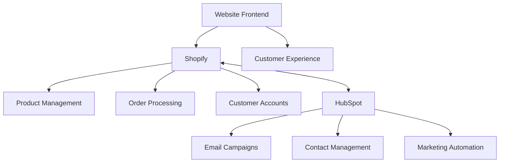

# Welldonewood Technical Documentation

This repository contains the technical documentation for the Welldonewood e-commerce platform, which specializes in thermally modified wood products.

## Core Systems

- **[Shopify](./shopify/README.md)**: E-commerce platform for product catalog and sales
- **[HubSpot](./hubspot/README.md)**: Marketing automation and CRM
- **[Website Architecture](./architecture/README.md)**: Site structure and design documentation

## System Overview



## Key Products

- Thermo-treated Decking
- Thermo-treated Siding
- Thermo-treated Fencing
- Interior Wood Products
- Specialty Products (Plywood, RollFloor)

## Technology Stack

- **E-commerce**: Shopify
- **CRM & Marketing**: HubSpot
- **Deployment**: Netlify/GitHub
- **Frontend**: Shopify Liquid Templating

## Documentation Organization

The documentation is organized into these key areas:

1. **Shopify Implementation**
   - [Shopify Overview](./shopify/README.md) - Implementation details and store configuration
   - [Collection Structure](./shopify/collections.md) - Product collection organization
   - [Page Templates](./shopify/page-templates.md) - Standard page layouts
   - [Product Data](./shopify/product-data.md) - Product information structure
   - [Theme Customization](./shopify/theme-customization.md) - Theme design and modifications

2. **HubSpot Implementation**
   - [HubSpot Overview](./hubspot/README.md) - Integration and automation details
   - [Email Templates](./hubspot/email-templates.md) - Standard email campaign formats

3. **Architecture Documentation**
   - [Architecture Overview](./architecture/README.md) - Site structure and technical design

## Implementation Status

- [x] Initial site structure planning
- [x] Product categorization schema
- [x] Shopify store setup
- [ ] Product catalog import
- [ ] Theme customization
- [ ] HubSpot integration
- [ ] API implementation

## Getting Started

For developers new to the project, start by reviewing the [Website Architecture](./architecture/README.md) and [Shopify Implementation](./shopify/README.md) documentation.

## Documentation Structure

```
DOCUMENTATION STRUCTURE
├── Shopify Implementation
│   ├── Store Structure
│   ├── Theme Customization
│   ├── Product Management
│   └── Integration Guides
│
├── HubSpot Implementation
│   ├── Marketing Automation
│   ├── Email Campaigns
│   ├── CRM Configuration
│   └── Integration Guides
│
├── Architecture
│   ├── System Overview
│   ├── Data Flow
│   ├── Integration Points
│   └── Security Measures
│
└── Development
    ├── Code Standards
    ├── Deployment Processes
    ├── Testing Procedures
    └── Maintenance Guidelines
```

## Related Resources

- [Shopify Admin](https://admin.shopify.com)
- [HubSpot Portal](https://app.hubspot.com)
- [Development Repository](https://github.com/welldonewood/e-commerce) 