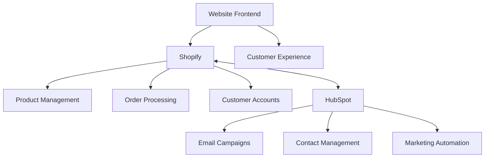

# Welldonewood Documentation

Welcome to the comprehensive documentation for Welldonewood, a company specializing in thermally modified wood products.

## Documentation Sections

### E-commerce Platform

* [**Shopify Implementation**](./shopify/)
  * [Collection Structure](./shopify/collections)
  * [Page Templates](./shopify/page-templates)
  * [Product Data Structure](./shopify/product-data)
  * [Theme Customization](./shopify/theme-customization)
  * [Product Cloning Guide](./shopify/product-cloning)

### Marketing & CRM

* [**HubSpot Implementation**](./hubspot/)
  * [Email Campaign Templates](./hubspot/email-templates)
  * [Automation Workflows](./hubspot/automation-workflows)

### Technical Design

* [**Website Architecture**](./architecture/)

## System Overview

The Welldonewood platform integrates several systems to provide a complete e-commerce and marketing solution:



## Key Products

- Thermo-treated Decking
- Thermo-treated Siding
- Thermo-treated Fencing
- Interior Wood Products
- Specialty Products (Plywood, RollFloor)

## Implementation Status

- [x] Initial site structure planning
- [x] Product categorization schema
- [x] Shopify store setup
- [ ] Product catalog import
- [ ] Theme customization
- [ ] HubSpot integration
- [ ] API implementation

## Getting Started

For developers new to the project, start by reviewing the [Website Architecture](./architecture/) and [Shopify Implementation](./shopify/) documentation.

## Documentation Structure

```
DOCUMENTATION STRUCTURE
├── Shopify Implementation
│   ├── Store Structure
│   ├── Theme Customization
│   ├── Product Management
│   └── Integration Guides
│
├── HubSpot Implementation
│   ├── Marketing Automation
│   ├── Email Campaigns
│   ├── CRM Configuration
│   └── Integration Guides
│
├── Architecture
│   ├── System Overview
│   ├── Data Flow
│   ├── Integration Points
│   └── Security Measures
│
└── Development
    ├── Code Standards
    ├── Deployment Processes
    ├── Testing Procedures
    └── Maintenance Guidelines
```

## Related Resources

- [Shopify Admin](https://admin.shopify.com)
- [HubSpot Portal](https://app.hubspot.com)
- [Development Repository](https://github.com/welldonewood/e-commerce) 