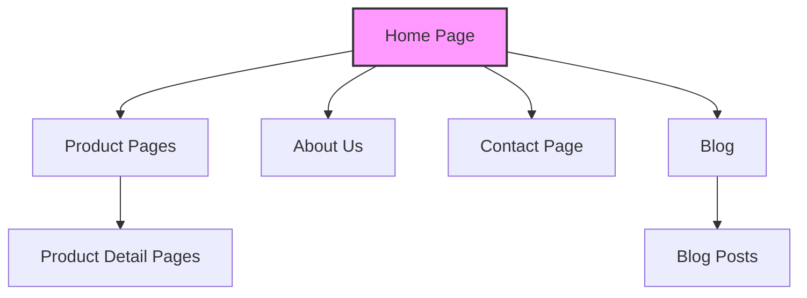
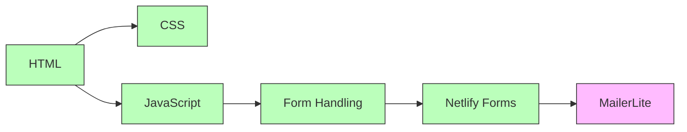
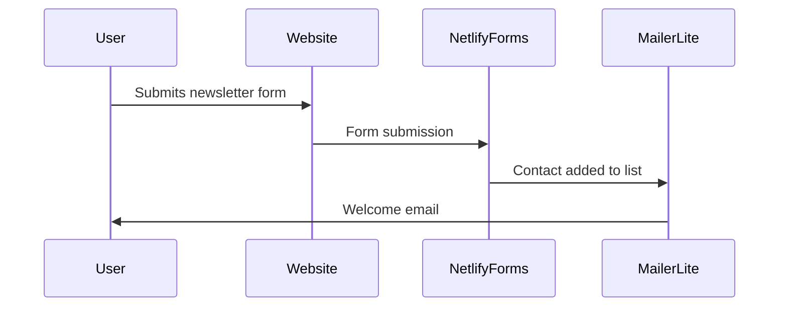
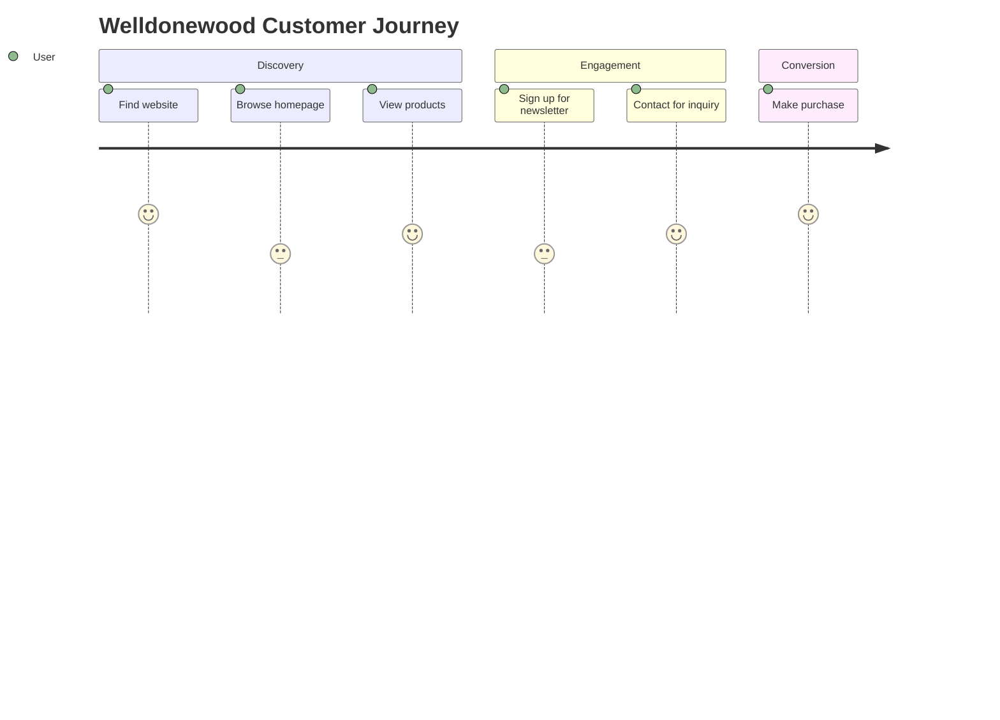
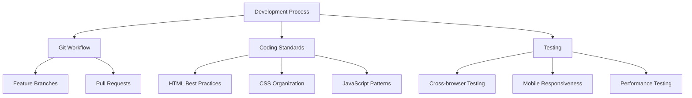
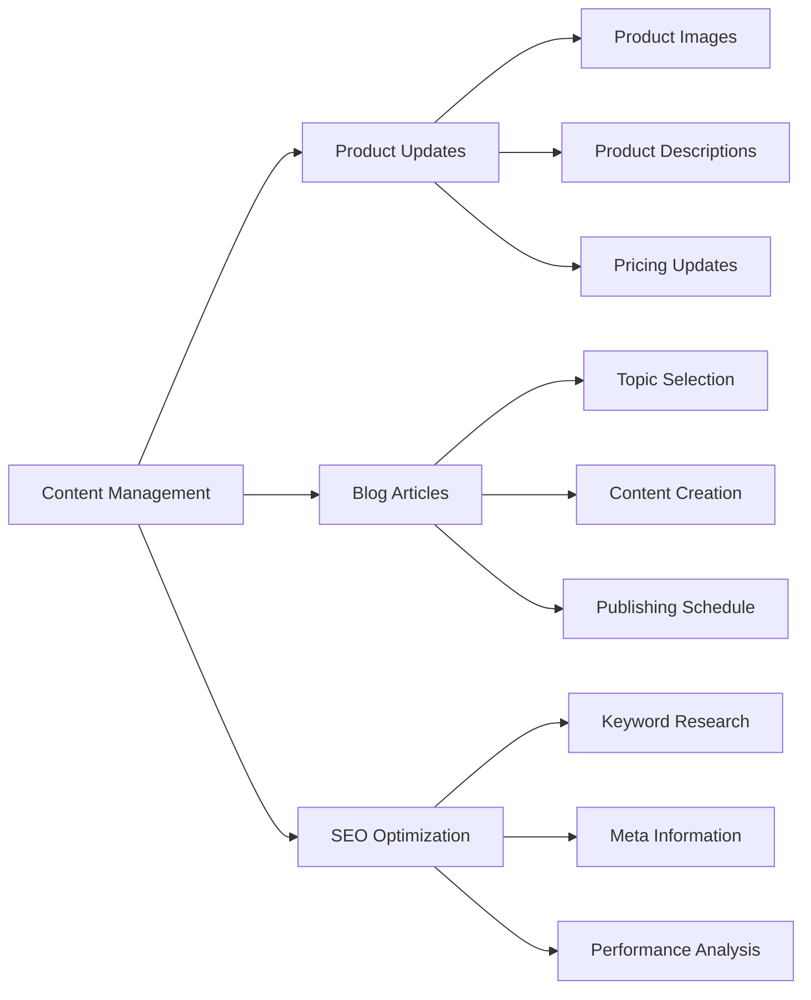

# Welldonewood Documentation Library

## Table of Contents
1. [Site Structure](#site-structure)
2. [Technical Architecture](#technical-architecture)
3. [Integration Flows](#integration-flows)
4. [User Journeys](#user-journeys)
5. [Development Guidelines](#development-guidelines)
6. [Content Management](#content-management)

## Site Structure

The Welldonewood website follows a structured approach to present woodworking products and services effectively.

### Current Pages
- **Home Page**: Main landing page with hero section, featured products, and newsletter signup
- **Products**: (To be implemented) Overview of product categories
- **About Us**: (To be implemented) Company history and values
- **Contact**: (To be implemented) Contact form and information
- **Blog**: (To be implemented) Woodworking tips and company updates

## Technical Architecture

The website is built using a modern web stack designed for performance and SEO optimization.

### Technology Stack
- **Frontend**: HTML5, CSS3, Vanilla JavaScript
- **Deployment**: Netlify
- **Form Processing**: Netlify Forms
- **Email Marketing**: MailerLite (planned integration)
- **Analytics**: Google Analytics (planned)

## Integration Flows

The website integrates with several third-party services to handle user interactions and marketing.

### Form Handling
1. User fills out the newsletter form on the homepage
2. Netlify Forms captures the submission
3. Data is exported to MailerLite via API
4. User receives a welcome email (automated)

## User Journeys

Understanding how users navigate through the site helps optimize the user experience.

### Primary User Flows
- **Product Discovery**: Homepage → Product Category → Product Detail → Contact
- **Newsletter Signup**: Homepage → Newsletter Form → Confirmation
- **Blog Engagement**: Homepage → Blog → Article → Related Products

## Development Guidelines

Best practices for maintaining and extending the website.

### Development Workflow
1. Create feature branch from main
2. Implement changes following coding standards
3. Test across browsers and devices
4. Create pull request with detailed description
5. Deploy to staging environment
6. Review and merge to main branch
7. Deploy to production

## Content Management

Guidelines for maintaining and updating website content.

### Content Update Process
1. Prepare content assets (text, images, videos)
2. Optimize media for web performance
3. Update relevant HTML pages
4. Add appropriate metadata and schema markup
5. Commit changes to GitHub
6. Deploy to production

---

*Note: This documentation is a living document and will be updated as the website evolves.*