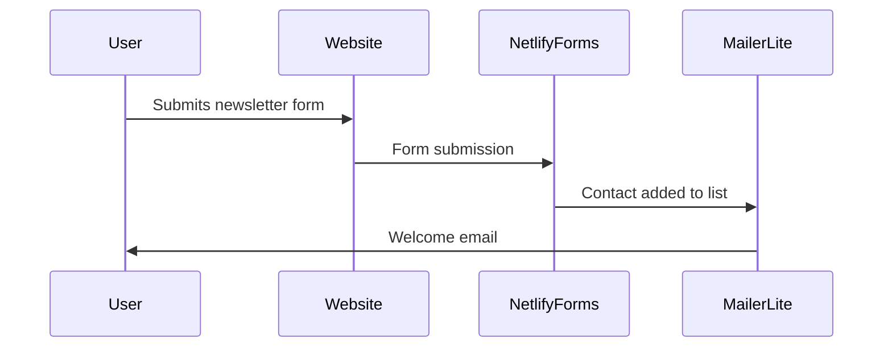
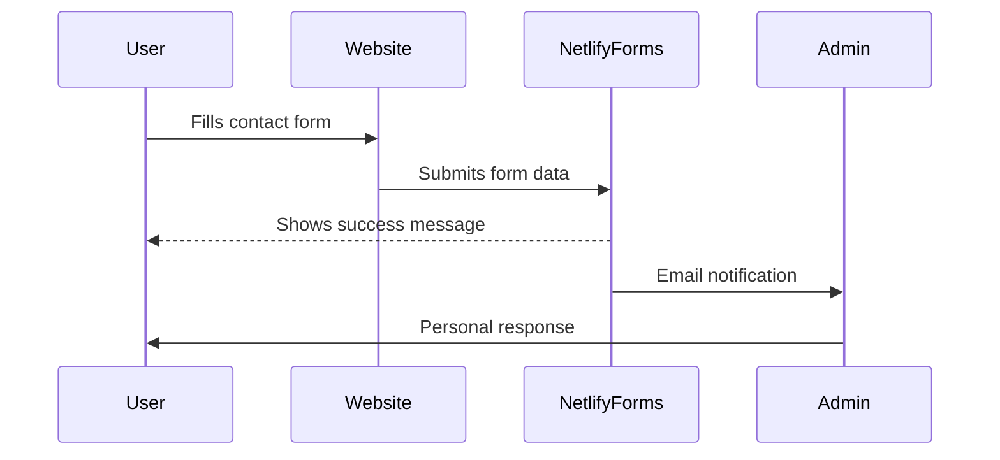

# Integration Flows

The website integrates with several third-party services to handle user interactions and marketing.

## Newsletter Signup Flow

### Process Steps

1. User fills out the newsletter form on the homepage
2. Netlify Forms captures the submission
3. Data is exported to MailerLite via API
4. User receives a welcome email (automated)

## Contact Form Flow

### Form Implementation

The forms are implemented using Netlify Forms, which provides:

- Built-in spam filtering
- Email notifications
- Data export options
- No server-side code required

## Third-Party Integrations

The website integrates with the following services:

- **Netlify**: Hosting, forms, and continuous deployment
- **MailerLite**: Email marketing and newsletter management
- **Google Analytics**: User behavior tracking and analytics

## API Authentication

All API integrations use secure authentication methods:

- Environment variables for API keys
- Netlify Functions for server-side API calls
- No client-side exposure of sensitive credentials 