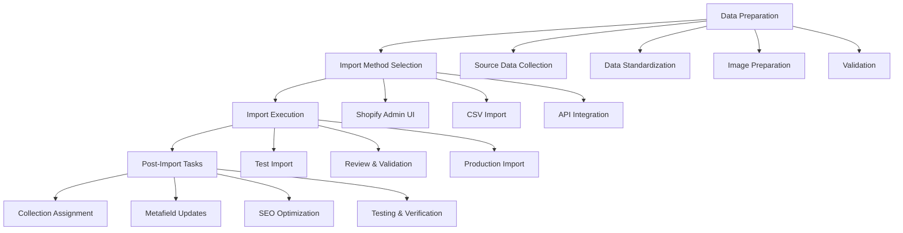
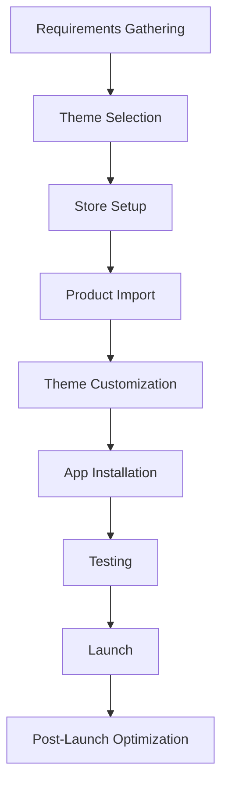

# Shopify Implementation for Welldonewood

This document outlines the Shopify implementation for the Welldonewood e-commerce platform.

## Store Configuration

- **Store URL**: [welldonewood2.myshopify.com](https://welldonewood2.myshopify.com)
- **Theme**: [Theme Name/ID TBD]
- **Plan Level**: [Plan Level TBD]

## Implementation Components

1. **[Product Data Structure](./product-data.md)**: Framework for product information
2. **[Collection Structure](./collections.md)**: Organization of product collections
3. **[Page Templates](./page-templates.md)**: Templates for different page types
4. **[Theme Customization](./theme-customization.md)**: Theme modification details
5. **[Third-Party Integrations](./integrations.md)**: External service connections

## Product Import Process

The process for importing products into the Welldonewood Shopify store follows these key steps:

### Import Methods

1. **Shopify Admin UI**: For small product additions (1-10 products)
   - Manual entry through Products > Add Product
   - Best for one-off additions and simple products

2. **CSV Import**: For bulk product additions (10+ products)
   - Structured import using Shopify's CSV format
   - Requires preparation according to [Product Data Structure](./product-data.md)
   - Handles variants, images, and basic product details

3. **API Integration**: For automated or recurring imports
   - Programmatic product creation via Shopify Admin API
   - Used for integration with inventory systems
   - Enables automated updates and maintenance

### Data Requirements

All product imports must adhere to the [Product Data Structure](./product-data.md) guidelines, with particular attention to:

- Standardized product titles and descriptions
- Consistent variant structure
- Complete metafield data
- High-quality images meeting specifications

### Post-Import Tasks

After import, products require:

1. Assignment to appropriate collections
2. SEO optimization
3. Testing across devices
4. Verification of inventory tracking
5. Quality assurance review

## Migration Plan from Existing Site

The migration from [welldonewood.com](https://www.welldonewood.com) to Shopify involves:

1. **Product Data Migration**
   - Export products from current site
   - Transform data to match Shopify structure
   - Import to Shopify via CSV or API

2. **Content Migration**
   - Recreate pages in Shopify
   - Transfer and optimize images
   - Update URLs and redirects

3. **SEO Preservation**
   - Maintain URL structure where possible
   - Set up 301 redirects
   - Preserve metadata

## Shopify Apps

The following Shopify apps will be installed:

| App | Purpose | Status |
|-----|---------|--------|
| Bulk Product Editor | Mass updates to products | To be installed |
| HubSpot | Marketing automation integration | To be installed |
| Improved Contact Form | Enhanced contact forms | To be installed |
| Product Reviews | Customer reviews | To be installed |
| SEO Optimizer | Search engine optimization | To be installed |

## Development Process

### Development Stages

1. **Setup Phase**
   - Create Shopify account
   - Configure basic settings
   - Set up payment gateways

2. **Content Phase**
   - Import products
   - Create collections
   - Develop content pages

3. **Design Phase**
   - Customize theme
   - Implement responsive design
   - Ensure brand consistency

4. **Integration Phase**
   - Connect HubSpot
   - Set up analytics
   - Configure shipping and taxes

5. **Launch Phase**
   - Final testing
   - DNS configuration
   - Public launch

## See Also

- [HubSpot Integration](../hubspot/README.md)
- [Website Architecture](../architecture/README.md) 