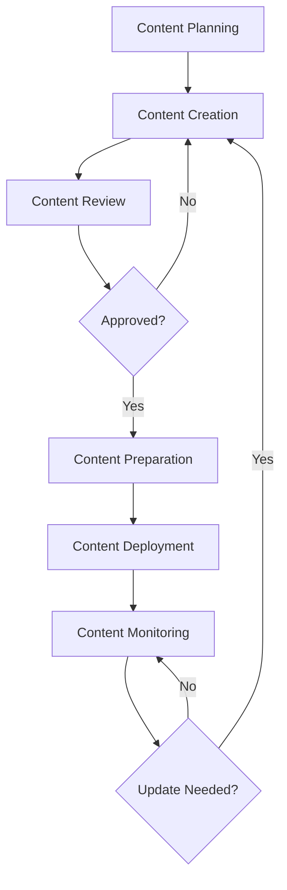
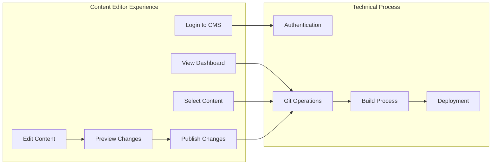
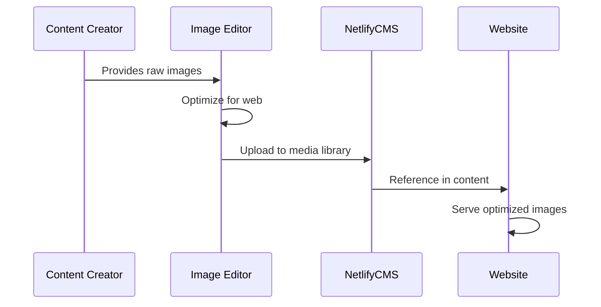
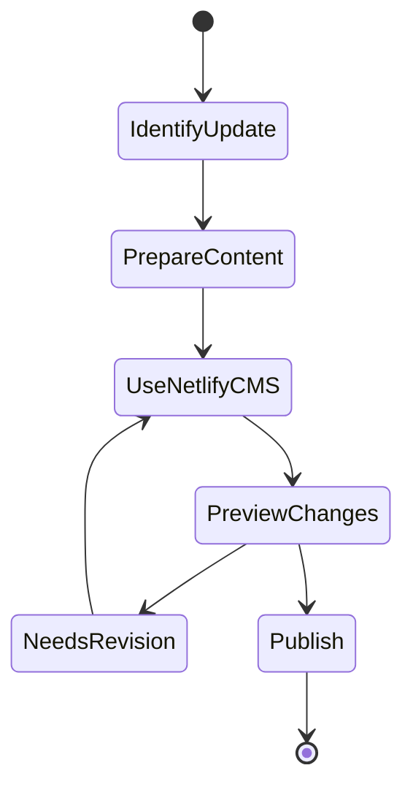
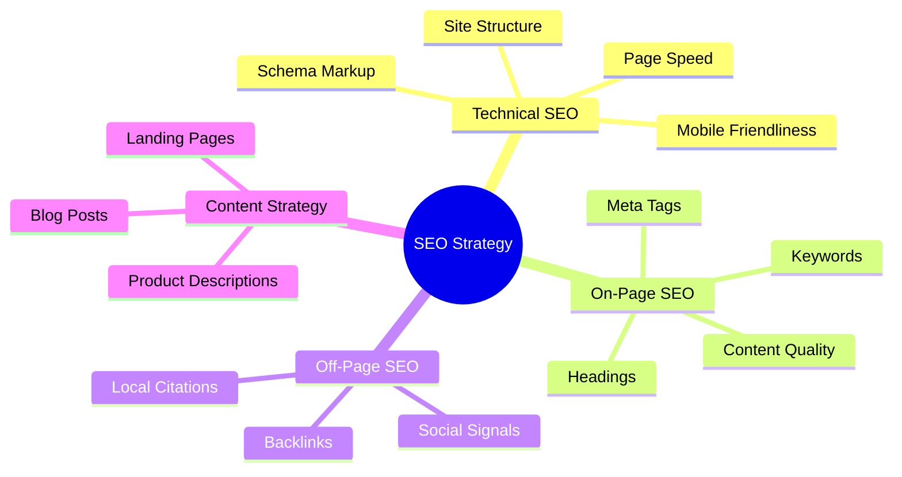

# Content Management

This document outlines the processes and best practices for managing content on the Welldonewood website.

## Content Workflow

## Content Management Tools

### Netlify CMS (Visual Editor)

The Welldonewood website uses Netlify CMS as its primary content management system, providing a user-friendly interface for content editors.

#### Accessing Netlify CMS

1. Navigate to `https://welldonewood.com/admin/`
2. Log in with your authorized credentials
3. You'll be presented with the dashboard showing editable content

#### Content Editing Process

1. **Select Content Type**: Choose the type of content you want to edit (page, product, blog post)
2. **Make Changes**: Use the visual editor to modify content
3. **Preview Changes**: Use the preview mode to see how changes will look on the live site
4. **Save & Publish**: Save your changes and publish when ready
5. **Automated Deployment**: Changes will be automatically deployed to the live site

#### Key Features

- **Rich Text Editor**: WYSIWYG editing for easy content formatting
- **Media Library**: Centralized management of images and other media assets
- **Workflows**: Optional editorial workflows for content review
- **Versioning**: All changes are tracked through Git
- **Scheduling**: Schedule content to be published at specific times

## Content Types

The website includes several content types, each with specific management requirements:

1. **Product Information**
   - Product descriptions
   - Technical specifications
   - Product images
   - Application examples

2. **Marketing Content**
   - Homepage hero sections
   - Promotional banners
   - Call-to-action elements
   - Value propositions

3. **Blog Content**
   - Industry articles
   - Project showcases
   - How-to guides
   - Company news

4. **Support Content**
   - Installation guides
   - Maintenance instructions
   - FAQs
   - Technical documentation

## Image Management Process

### Image Management in Netlify CMS

1. **Uploading Images**
   - Access the Media Library section in Netlify CMS
   - Upload images (optimized according to guidelines)
   - Images are stored in the Git repository

2. **Using Images in Content**
   - When editing content, click the image button
   - Select an image from the Media Library
   - Adjust size and alignment as needed
   - Add appropriate alt text for accessibility

3. **Image Organization**
   - Images are organized by folders in the Media Library
   - Use consistent naming conventions
   - Include metadata for better searchability

### Image Optimization Guidelines

1. **File Formats**:
   - Use WebP as primary format with JPEG fallback
   - Use SVG for logos and icons
   - Use PNG only when transparency required

2. **Image Dimensions**:
   - Hero images: 1920x1080px max
   - Product thumbnails: 400x400px
   - Gallery images: 800x600px
   - Team photos: 500x500px

3. **Optimization Settings**:
   - WebP quality: 80%
   - JPEG quality: 85%
   - Enable lazy loading for below-fold images
   - Include appropriate alt text

## Content Update Workflow

### Content Update Best Practices

1. **Regular Audits**: Conduct monthly content audits to identify outdated information
2. **Update Schedule**: Maintain a content update schedule for key pages
3. **Version Control**: Use Netlify CMS's version history to track changes
4. **Collaborative Review**: Have team members review changes before publishing
5. **Update Announcements**: Communicate significant content updates to stakeholders

## SEO Guidelines

### SEO Features in Netlify CMS

Netlify CMS provides fields for managing important SEO elements:

1. **Title Tags & Meta Descriptions**
   - Dedicated fields for SEO titles and descriptions
   - Character count indicators
   - Preview of search appearance

2. **Structured Data**
   - Fields for product specifications
   - Schema markup generation
   - Review and rating information

3. **Image SEO**
   - Alt text fields for all images
   - Caption and description fields
   - Image dimension control

### SEO Best Practices

1. **Title Tags**:
   - Include primary keyword near the beginning
   - Keep under 60 characters
   - Make each title unique
   - Include brand name

2. **Meta Descriptions**:
   - Include primary and secondary keywords
   - Keep under 160 characters
   - Include a call-to-action
   - Make compelling for clicks

3. **URL Structure**:
   - Keep URLs short and descriptive
   - Include target keywords
   - Use hyphens to separate words
   - Avoid parameters when possible

4. **Content Guidelines**:
   - Minimum 300 words for key pages
   - Include primary keyword in first paragraph
   - Use header tags (H1, H2, H3) logically
   - Include internal links to related content

## Social Media Integration

Netlify CMS supports the creation and management of content for social media platforms:

1. **Content Adaptation**
   - Create versions of content optimized for social platforms
   - Prepare social media images with correct dimensions
   - Schedule posts through integrated tools

2. **Cross-Posting**
   - Automatically share blog posts to social media
   - Configure which platforms receive which content
   - Customize messaging for each platform

3. **Social Media Calendar**
   - Plan and schedule content in advance
   - Coordinate with website content updates
   - Maintain consistent messaging across channels 