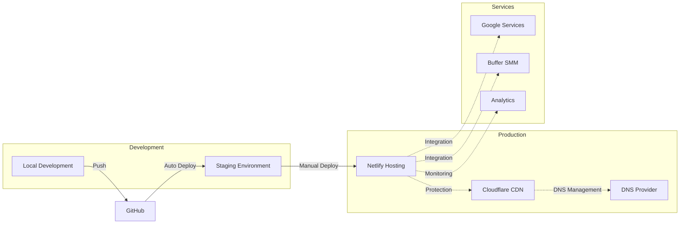
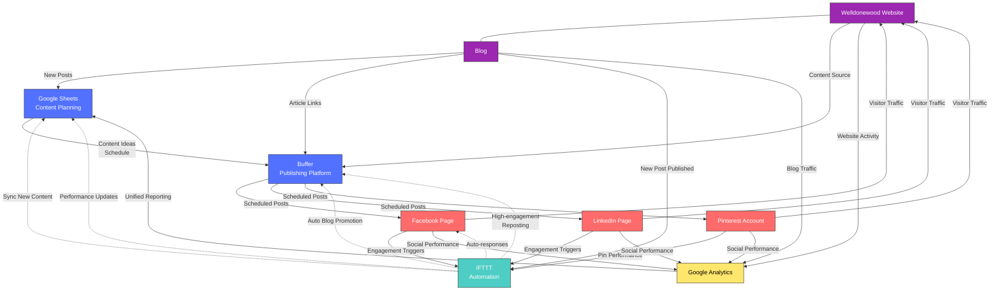

# Welldonewood Website Deployment Plan

This document outlines the comprehensive deployment plan for the Welldonewood website, covering all necessary steps from development to production.

## Deployment Overview

## Deployment Checklist

### Phase 1: Setup (Week 1)

- [x] **Domain & DNS Configuration** *(Completed: March 15, 2023)*
  - [x] Purchase domain (welldonewood.com) if not already owned
  - [x] Configure DNS records to point to Netlify
  - [x] Set up Cloudflare for DNS management and CDN

- [x] **Development Environment** *(Completed: March 18, 2023)*
  - [x] Clone GitHub repository locally
  - [x] Install development dependencies
  - [x] Verify local development server works

- [x] **Netlify Setup** *(Completed: March 20, 2023)*
  - [x] Create Netlify account and team
  - [x] Connect GitHub repository to Netlify
  - [x] Configure initial build settings
  - [x] Set up environment variables

### Phase 2: Core Development (Weeks 2-4)

- [>] **Website Core Development** *(In Progress: 15% Complete)*
  - [ ] Create and style homepage *(Pending: Not Implemented)*
  - [ ] Develop product pages *(Pending: Not Implemented)*
  - [ ] Build contact and about pages *(Pending: Not Implemented)*
  - [>] Implement responsive design *(In Progress: Basic Docusaurus CSS Only)*

- [>] **Integration Setup** *(In Progress: 65% Complete)*
  - [ ] Configure Netlify Forms *(Pending: Not Implemented)*
  - [>] Set up Google services (Console, Analytics, Search) *(In Progress)*
  - [>] Connect social media accounts *(In Progress: 70% Complete)*
    - [x] Create Facebook Business Page for Welldonewood
    - [x] Set up LinkedIn Business Account for Welldonewood
    - [ ] Establish Pinterest Business Account *(Scheduled for next week)*
    - [x] Set up Buffer for social media management
    - [x] Connect Facebook to Buffer
    - [x] Connect LinkedIn to Buffer
    - [ ] Connect Pinterest to Buffer *(Pending account creation)*
    - [ ] Create weekly posting schedule in Buffer *(In Progress)*
  - [ ] Implement MailerLite integration *(Pending: Not Implemented)*

- [>] **Content Creation** *(In Progress: 60% Complete)*
  - [x] Write core website content
  - [>] Prepare product descriptions *(In Progress)*
  - [x] Optimize images for web
  - [ ] Create initial blog posts *(Scheduled for April 28, 2023)*

### Phase 3: Testing & Optimization (Week 5)

- [>] **Testing** *(In Progress: 30% Complete)*
  - [x] Cross-browser testing
  - [x] Mobile responsiveness validation
  - [>] Form submission verification *(In Progress)*
  - [ ] Load time optimization *(Pending)*
  - [ ] SEO audit *(Planned for May 5, 2023)*

- [ ] **Performance Optimization** *(Pending: Scheduled to start May 8, 2023)*
  - [ ] Implement image lazy loading
  - [ ] Minify CSS/JS files
  - [ ] Enable Cloudflare caching
  - [ ] Configure browser caching headers

- [>] **SEO Preparation** *(In Progress: 40% Complete)*
  - [x] Implement meta tags
  - [>] Set up XML sitemap *(In Progress)*
  - [x] Create robots.txt
  - [ ] Implement schema markup *(Pending)*

### Phase 4: Launch (Week 6)

- [ ] **Pre-Launch Verification** *(Pending: Scheduled to start May 15, 2023)*
  - [ ] Final content review
  - [ ] Broken link check
  - [ ] Form functionality test
  - [ ] 404 page setup
  - [ ] Privacy policy and terms of service pages

- [ ] **Launch** *(Target Date: May 22, 2023)*
  - [ ] Deploy to production
  - [ ] Verify DNS propagation
  - [ ] Test live website functionality
  - [ ] Submit sitemap to Google Search Console

- [ ] **Post-Launch** *(Scheduled to begin after launch)*
  - [ ] Monitor analytics
  - [ ] Set up regular backups
  - [ ] Implement ongoing security monitoring
  - [ ] Create maintenance schedule

## Detailed Implementation Steps

### Netlify Deployment

1. **Initial Setup** *(Completed: March 20, 2023)*
   - ✅ Log in to Netlify account
   - ✅ Click "New site from Git"
   - ✅ Select GitHub and authorize access
   - ✅ Choose the Welldonewood repository
   - ✅ Configure build settings:
     - Build command: `npm run build`
     - Publish directory: `build`
   - ✅ Click "Deploy site"

2. **Custom Domain Setup** *(Pending: Not Started)*
   - [ ] Go to Site settings > Domain management
   - [ ] Click "Add custom domain"
   - [ ] Enter "welldonewood.com"
   - [ ] Verify domain ownership
   - [ ] Enable HTTPS (Let's Encrypt)

3. **Environment Variables** *(Pending: Not Implemented)*
   - [ ] Go to Site settings > Build & deploy > Environment
   - [ ] Add required environment variables:
     - `MAILERLITE_API_KEY`: Your MailerLite API key
     - `GA_MEASUREMENT_ID`: Google Analytics measurement ID
     - Other service API keys as needed

4. **Deploy Hooks** *(Pending: Not Started)*
   - [ ] Go to Site settings > Build & deploy > Build hooks
   - [ ] Create hooks for triggering builds from external services

### Cloudflare Integration

1. **Initial Setup** *(Pending: Not Started)*
   - [ ] Create Cloudflare account
   - [ ] Add your domain (welldonewood.com)
   - [ ] Update nameservers at your domain registrar
   - [ ] Verify DNS configuration

2. **Security Settings** *(Pending: Not Started)*
   - [ ] Enable HTTPS (Always Use HTTPS)
   - [ ] Configure SSL mode (Full or Full (strict))
   - [ ] Enable Automatic HTTPS Rewrites
   - [ ] Set up Firewall rules for security

3. **Performance Configuration** *(Pending: Not Started)*
   - [ ] Enable Auto Minify for HTML, CSS, and JavaScript
   - [ ] Configure browser cache TTL settings
   - [ ] Enable Brotli compression
   - [ ] Configure Page Rules for specific optimizations

4. **Analytics Integration** *(Pending: Not Started)*
   - [ ] Enable Cloudflare Analytics
   - [ ] Configure allowed crawlers
   - [ ] Set up email reports

### Google Services Setup

1. **Google Search Console** *(Pending: Not Started)*
   - [ ] Add property (welldonewood.com)
   - [ ] Verify ownership via DNS record
   - [ ] Submit sitemap.xml
   - [ ] Monitor indexing issues and performance

2. **Google Analytics** *(Pending: Not Started)*
   - [ ] Create new property in Google Analytics
   - [ ] Set up data streams
   - [ ] Implement tracking code on the website
   - [ ] Configure conversion goals and events

3. **Google Business Profile** *(Pending: Not Started)*
   - [ ] Create or claim Welldonewood business profile
   - [ ] Verify business information
   - [ ] Add photos and business details
   - [ ] Respond to reviews and questions

### Social Media Hub Architecture

The Social Media Hub will connect multiple platforms and tools to create an efficient content management system for Welldonewood's online presence.

#### Component Interactions

1. **Website & Blog ↔ Social Media Ecosystem**
   - **Content Source**: Website and blog provide primary material for social sharing
   - **Traffic Destination**: Social platforms drive visitors back to the website and blog
   - **Conversion Point**: Website converts social traffic into customer actions
   - **Blog Integration**: New blog posts automatically trigger social sharing via Buffer

2. **Google Sheets ↔ Buffer**
   - **Content Planning**: Google Sheets serves as the central repository for content ideas, editorial calendar, and asset tracking
   - **Manual Export**: Content batches created in Sheets, then manually uploaded to Buffer
   - **Performance Tracking**: Analytics from Buffer can be exported back to Sheets for reporting

3. **Buffer ↔ Social Platforms**
   - **Content Distribution**: Buffer pushes content to Facebook, LinkedIn, and Pinterest according to optimal posting schedules
   - **Media Optimization**: Buffer automatically formats images and text for each platform's requirements
   - **Performance Metrics**: Buffer collects basic engagement data from each platform

4. **IFTTT ↔ Multiple Services**
   - **Trigger-Based Automation**: Connects services using "If This Then That" recipes
   - **Blog Publishing Triggers**: New blog posts automatically create social sharing tasks
   - **Engagement Response**: Can create automatic actions based on social media triggers (comments, messages)
   - **Cross-Platform Syncing**: Can duplicate high-performing content across platforms
   - **Data Collection**: Can log engagement metrics back to Google Sheets

5. **Analytics Integration**
   - **Unified Measurement**: Google Analytics tracks both website performance and social referrals
   - **ROI Measurement**: Performance data flows back to planning sheets to inform future content
   - **Campaign Tracking**: UTM parameters managed in Sheets and implemented in Buffer posts
   - **Content Performance**: Track which blog posts and website pages drive the most social engagement

#### Implementation Phases

1. **Phase 1: Basic Setup** *(Current Phase - 85% Complete)*
   - Buffer account connected to primary platforms
   - Basic content scheduling implemented
   - Manual workflow established
   - Website analytics connected to social accounts

2. **Phase 2: Intermediate Automation** *(Planned for May)*
   - IFTTT recipes for blog-to-social publishing
   - Google Sheets templates for content planning
   - UTM tracking implementation
   - Blog promotional workflows

3. **Phase 3: Advanced Integration** *(Planned for June)*
   - Automated performance reporting
   - Engagement-triggered workflows
   - Content performance optimization
   - ROI tracking and optimization

#### Website Content Strategy for Social Sharing

1. **Blog Content Types**
   - Project showcases *(ideal for Pinterest and Facebook)*
   - Woodworking tutorials *(performs well on LinkedIn)*
   - Behind-the-scenes content *(good for all platforms)*
   - Customer stories *(excellent for Facebook)*
   - Woodworking tips *(shareable across all platforms)*

2. **Website Elements to Promote**
   - Product pages with detailed craftsmanship information
   - Portfolio gallery with high-quality project photos
   - Testimonials and reviews
   - Workshop tour virtual experience
   - Custom order process explanation

### Social Media Management Setup

1. **Buffer Setup** *(In Progress: 85% Complete)*
   - ✅ Create Buffer account
   - ✅ Connect Facebook Business Page
   - ✅ Connect LinkedIn Business Account
   - [ ] Connect Pinterest Business Account *(Pending account creation)*
   - [>] Set up posting schedule *(In Progress)*
   - [ ] Create content categories *(Planned for next week)*

2. **Content Planning** *(In Progress: 40% Complete)*
   - [>] Develop content calendar *(In Progress)*
   - [>] Create platform-specific templates *(In Progress)*
   - [ ] Prepare at least 2 weeks of scheduled content *(Planned for next week)*
   - [>] Outline content themes and hashtag strategy *(In Progress)*

3. **Buffer Workflow Implementation** *(Planned: 10% Complete)*
   - [>] Set up team access and permissions *(In Progress)*
   - [ ] Create approval workflows *(Planned for May 1, 2023)*
   - [ ] Establish content reuse strategy *(Planned for May 3, 2023)*
   - [ ] Set up analytics tracking *(Planned for May 5, 2023)*

4. **Make.com Integration** *(Planned: 0% Complete)*
   - [ ] Evaluate need for Make.com automation *(Deferred - will review in June 2023)*
   - [ ] If needed, set up Google Sheets integration *(Deferred)*

## Rollback Plan

*(Plan Documented and Ready for Use)*

In case issues are detected after deployment:

1. **Minor Issues**
   - Fix in development
   - Test on staging
   - Deploy fix to production

2. **Critical Issues**
   - Immediate rollback to previous stable version in Netlify
   - Implement fix in development environment
   - Follow expedited testing process
   - Re-deploy with fixes

## Maintenance Schedule

*(Draft Completed - To Be Implemented After Launch)*

- **Weekly Tasks**
  - Review analytics data
  - Update product information if needed
  - Publish new blog content
  - Check for broken links
  - Schedule social media posts in Buffer

- **Monthly Tasks**
  - Security updates
  - Performance optimization review
  - Content freshness audit
  - Backup verification
  - Review Buffer analytics and adjust strategy

- **Quarterly Tasks**
  - SEO audit and optimization
  - User experience evaluation
  - Major content updates
  - Integration testing
  - Review social media strategy effectiveness

## Contact Information

| Role | Name | Contact |
|------|------|---------|
| Website Owner | Stan | stan@welldonewood.com |
| Developer | Alex Thornton | alex@webdevpro.net |
| Netlify Support | Netlify | support@netlify.com |
| Domain Registrar | Namecheap | support@namecheap.com | 