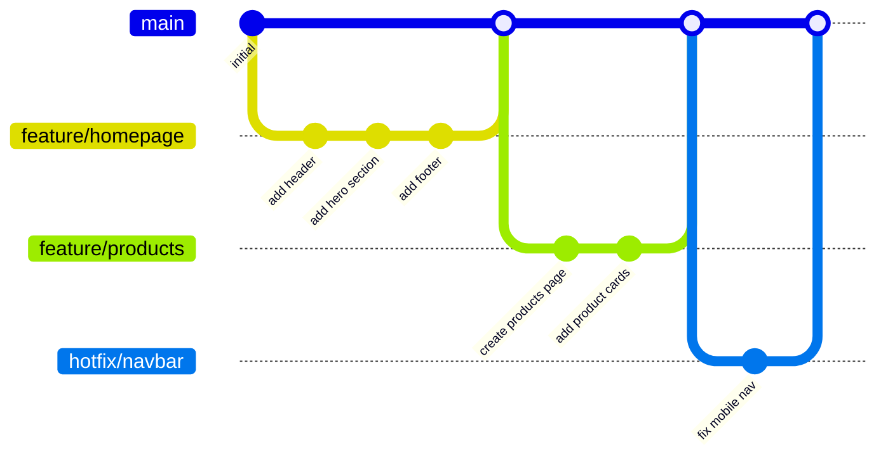
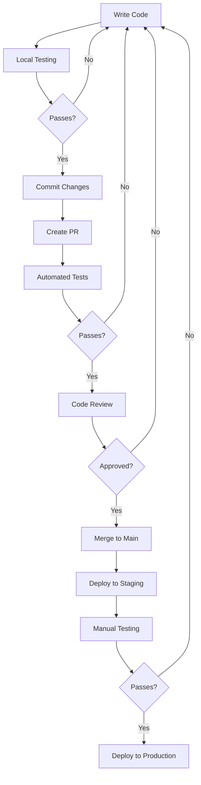
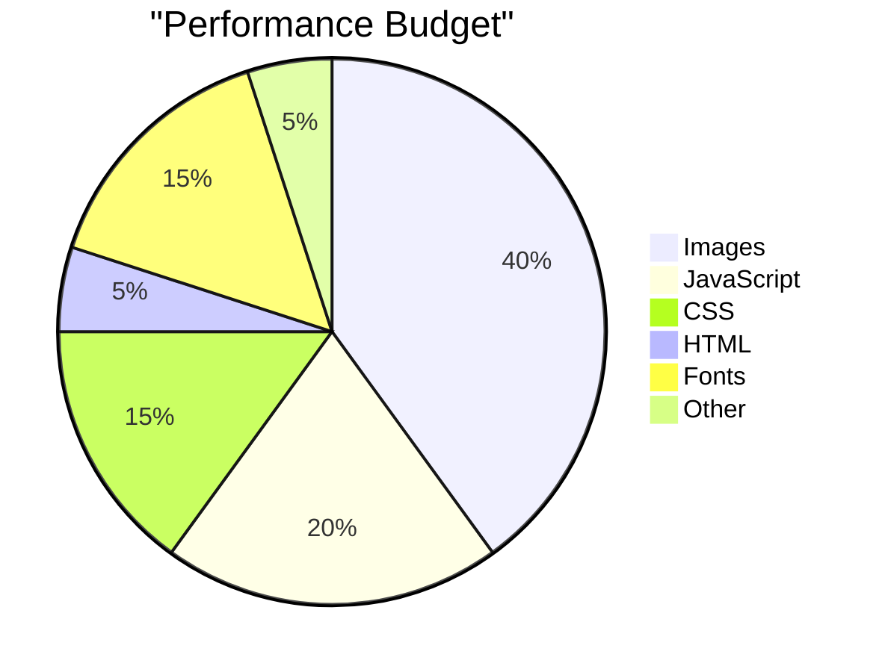

# Development Guidelines

This document outlines the development practices and workflows for the Welldonewood website.

## Development Workflow



### Branching Strategy

We follow a simplified Git flow with these branch types:

- `main`: Production-ready code
- `feature/*`: New features or significant changes
- `bugfix/*`: Bug fixes that aren't urgent
- `hotfix/*`: Critical fixes needed in production
- `docs/*`: Documentation-only changes

### Pull Request Process

1. Create a feature branch from `main`
2. Make your changes with appropriate commits
3. Push your branch and create a Pull Request
4. Request review from at least one team member
5. Address any review comments
6. Merge to `main` when approved

## Coding Standards

### HTML

- Use semantic HTML5 elements
- Include appropriate ARIA attributes for accessibility
- Keep nesting to a maximum of 4 levels
- Use comments for complex structures

### CSS

- Follow BEM (Block Element Modifier) methodology
- Use variables for colors, fonts, and spacing
- Organize CSS by component
- Prioritize flexbox and grid for layouts

### JavaScript

- Use ES6+ syntax
- Prefer const over let, avoid var
- Comment complex logic
- Keep functions small and focused

## Testing Guidelines



### Testing Checklist

Before deploying to production, verify:

- Cross-browser compatibility (Chrome, Firefox, Safari, Edge)
- Mobile responsiveness (iPhone, Android devices, tablets)
- Performance optimization (PageSpeed score > 85)
- Accessibility standards (WCAG 2.1 AA compliance)
- All form submissions work correctly
- All links are valid and working

## Deployment Process

```mermaid
sequenceDiagram
    participant Developer
    participant GitHub
    participant Netlify
    participant CDN
    participant End User
    
    Developer->>GitHub: Push to main branch
    GitHub->>Netlify: Trigger build webhook
    Netlify->>Netlify: Build static site
    Netlify->>Netlify: Run post-processing
    Netlify->>CDN: Deploy to CDN
    CDN->>End User: Serve optimized content
```

### Deployment Steps

1. Merge approved PR to `main`
2. Automated build triggered on Netlify
3. Build process runs (HTML, CSS, JS optimization)
4. Deploy to Netlify CDN
5. Run lighthouse tests on deployed site
6. Monitor analytics for any issues

## Performance Optimization



### Performance Guidelines

- Image optimization: WebP format with appropriate compression
- Lazy loading for below-the-fold images
- CSS minification and critical CSS inlining
- JavaScript bundling and tree-shaking
- Efficient cache policies for static assets
- HTTP/2 and CDN delivery for all assets 