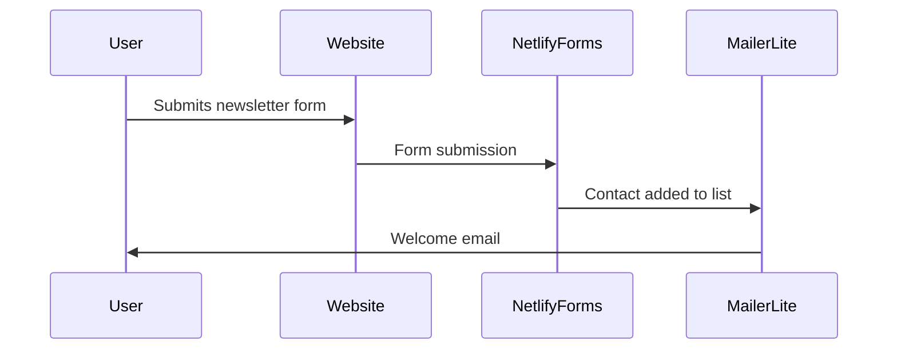
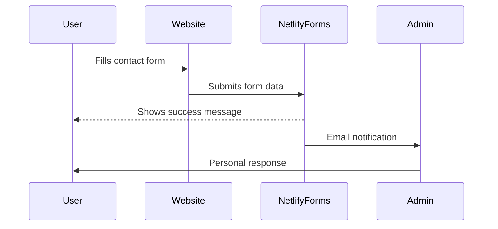
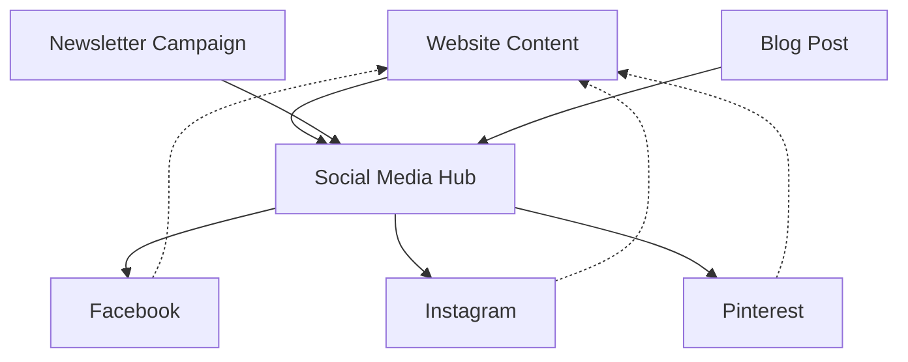
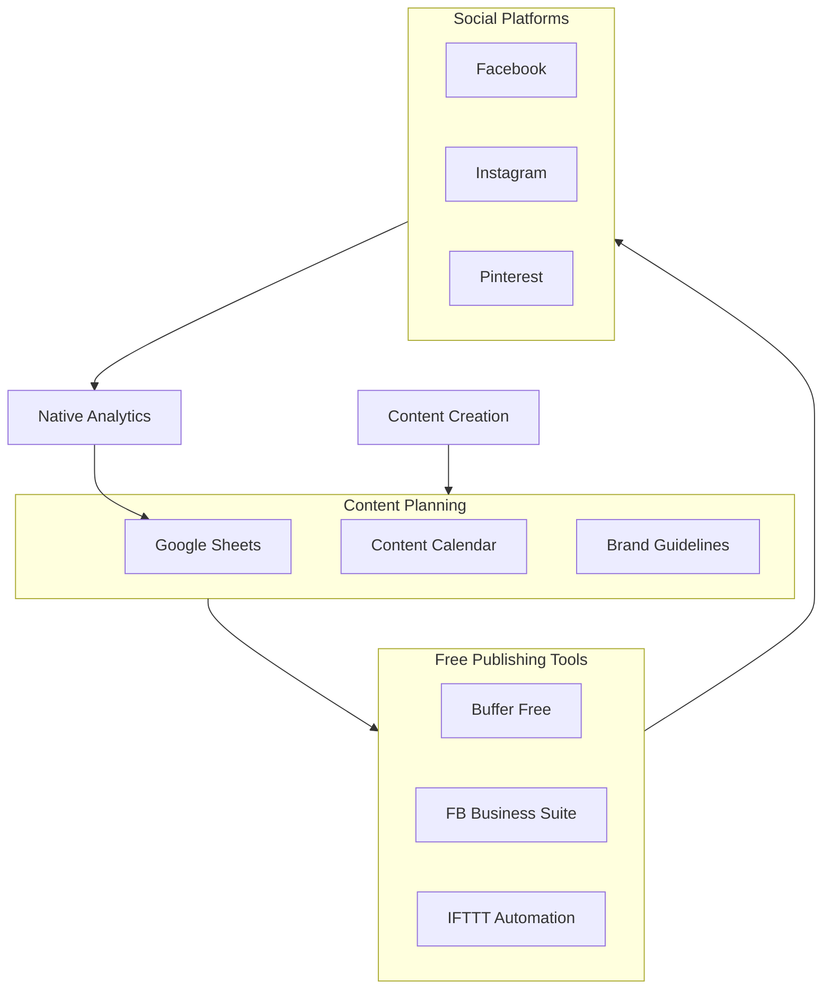
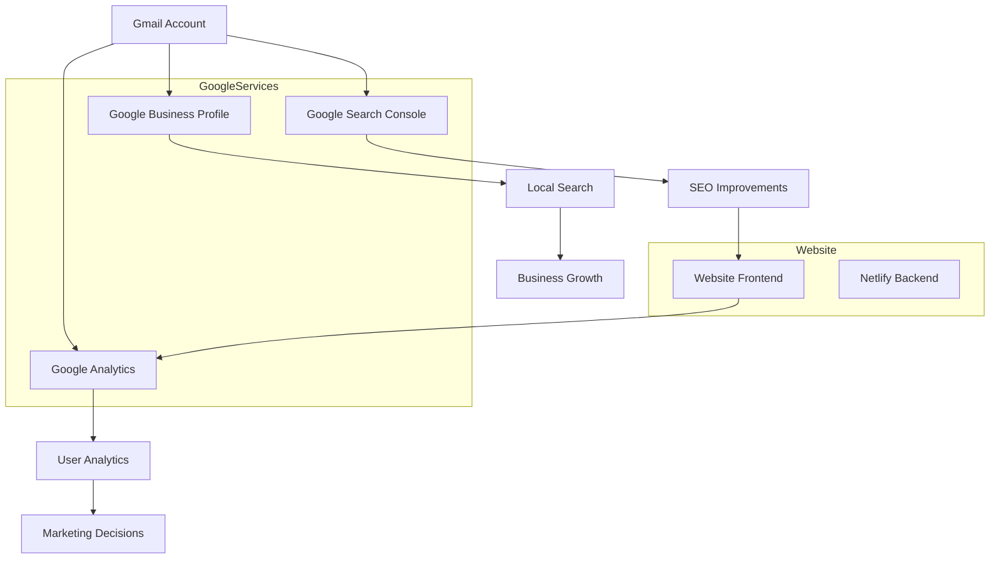
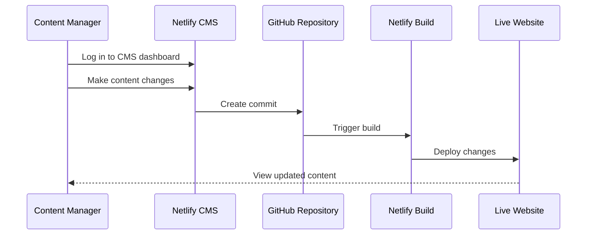

# Integration Flows

The website integrates with several third-party services to handle user interactions and marketing.

## Newsletter Signup Flow

### Process Steps

1. User fills out the newsletter form on the homepage
2. Netlify Forms captures the submission
3. Data is exported to MailerLite via API
4. User receives a welcome email (automated)

## Contact Form Flow

### Form Implementation

The forms are implemented using Netlify Forms, which provides:

- Built-in spam filtering
- Email notifications
- Data export options
- No server-side code required

## Social Media Marketing Integration

### Social Media Platforms

The website integrates with these social media platforms:

1. **Facebook**
   - Business page for Welldonewood
   - Content sharing via API
   - Event promotion
   - Customer engagement
   
2. **Instagram**
   - Product showcases
   - Project galleries
   - Behind-the-scenes content
   - Customer spotlights
   
3. **Pinterest**
   - Product pins
   - Inspiration boards
   - DIY project ideas
   - Visual content marketing

### Free Social Media Hub Implementation

The Social Media Hub can be implemented using free tools and services:

#### Free Tools Setup

1. **Google Sheets as Central Hub** (Free)
   - Create a content calendar spreadsheet with tabs for:
     - Editorial calendar (dates, platforms, topics)
     - Content ideas and brainstorming
     - Performance tracking
     - URL shortening tracking
   - Share with team members for collaborative planning
   - Template link: [bit.ly/social-template](https://docs.google.com/spreadsheets/create) (placeholder)

2. **Buffer Free Plan** (Free - 3 accounts, 10 scheduled posts)
   - Connect Facebook, Instagram, and Pinterest accounts
   - Schedule core promotional content
   - Use for most important announcements and product features
   - Best for planned, strategic content

3. **Facebook Business Suite** (Free)
   - Manage both Facebook and Instagram posts, stories, and messaging
   - Schedule content specific to these platforms
   - Respond to comments and messages
   - View basic analytics

4. **IFTTT Automation** (Free)
   - Create applets to cross-post between platforms
   - Example applets:
     - "When a new blog post is published, share to Facebook"
     - "When a photo is posted to Instagram, save to Pinterest board"
     - "When a product is added to the website, draft a social post"

#### Workflow Process

1. **Planning Stage** (Google Sheets)
   - Plan monthly content themes and weekly topics
   - Assign content creation responsibilities
   - Track important dates, promotions, and seasonal content

2. **Content Creation**
   - Create text, images, and videos based on the content calendar
   - Store in shared Google Drive folder organized by platform/date
   - Use Canva Free for graphic design if needed

3. **Scheduling** (Mixed approach)
   - High-priority content: Schedule via Buffer (10 posts limit)
   - Facebook/Instagram content: Schedule via Facebook Business Suite
   - Pinterest content: Schedule directly or use Buffer remaining slots
   - Automation: Set up IFTTT applets for cross-posting and repetitive tasks

4. **Engagement & Monitoring**
   - Create a daily 15-minute check-in schedule to respond to comments
   - Divide platform monitoring responsibilities among team members
   - Use native platform notifications for timely responses

5. **Analytics & Reporting**
   - Collect data from native platform analytics monthly
   - Record key metrics in the Google Sheets performance tab
   - Adjust strategy based on performance data

#### Limitations and Considerations

- **Buffer Free Plan**: Limited to 10 scheduled posts per profile, requiring manual scheduling for additional content
- **Manual Coordination**: More manual effort required compared to paid solutions
- **Limited Analytics**: Basic metrics available; advanced reporting requires manual compilation
- **Time Investment**: Requires disciplined time management for daily platform checks and engagement
- **Scaling Challenges**: As social presence grows, may need to eventually upgrade to paid solutions

### SMM Integration Flow

1. **Content Creation**: Website content, product photos, and blog posts are created
2. **Content Adaptation**: Content is adapted for each social media platform's format
3. **Scheduled Publishing**: Posts are scheduled using a social media management tool
4. **Cross-Promotion**: Content is cross-promoted across platforms
5. **Engagement Monitoring**: Responses and engagement are monitored and managed
6. **Analytics Tracking**: Performance is measured with platform-specific analytics

## Google Services Integration

### Google Account Management

The Welldonewood Google services are managed through the Gmail account (stan@welldonewood.com):

1. **Account Access**
   - All Google services are linked to this primary account
   - Team members can be granted appropriate access levels
   - Security is maintained with 2-factor authentication

2. **Google Search Console Setup**
   - Website property verification via DNS
   - Sitemap submission and indexing management
   - Performance monitoring and issue resolution
   - Mobile usability testing

3. **Google Analytics Implementation**
   - GA4 property setup with appropriate data streams
   - Enhanced measurement configuration
   - Goal and conversion tracking
   - Custom event implementation
   - Audience definition and analysis

4. **Google Business Profile Management**
   - Business verification and information management
   - Photo uploads and regular updates
   - Review monitoring and response
   - Post updates for promotions or news

## Third-Party Integrations

The website integrates with the following services:

- **Netlify**: Hosting, forms, and continuous deployment
- **MailerLite**: Email marketing and newsletter management
- **Google Analytics**: User behavior tracking and analytics
- **Social Media Platforms**: Content sharing and engagement
- **Cloudflare**: CDN, security, and performance optimization

## Netlify Visual Editor

### Visual Editor Features

Netlify CMS provides non-technical users with an easy way to update content:

1. **User-Friendly Interface**
   - Intuitive WYSIWYG editor
   - Media library for image management
   - Content preview functionality
   
2. **Content Management**
   - Product updates
   - Blog post creation and editing
   - Team member information updates
   - General content maintenance
   
3. **Workflow Management**
   - Editorial workflow with drafts and review
   - Content scheduling
   - User permission management
   - Version history and rollbacks

## API Authentication

All API integrations use secure authentication methods:

- Environment variables for API keys
- Netlify Functions for server-side API calls
- No client-side exposure of sensitive credentials
- Cloudflare for additional security layer 