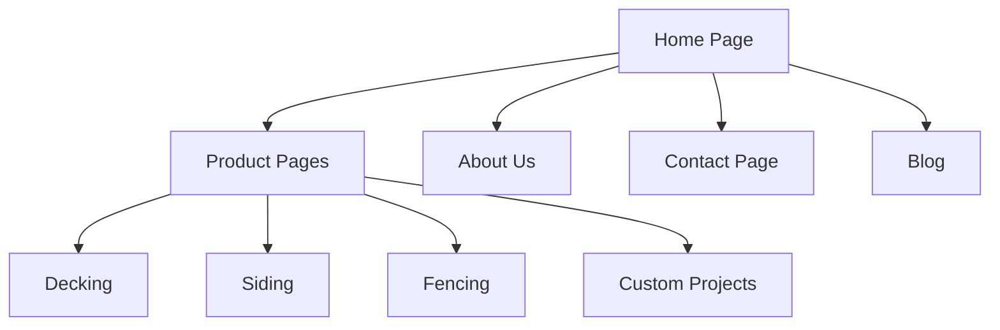

# Site Structure

The Welldonewood website follows a structured approach to present woodworking products and services effectively.

## Page Hierarchy

The website comprises the following key pages:

- **Home Page**: Main landing page featuring featured products, value propositions, and newsletter signup
- **Products**: Catalog of woodworking products organized by category
- **About Us**: Company information, history, and values
- **Contact**: Contact information and inquiry form
- **Blog**: Educational content and project showcases

## Current Pages

- The Home Page is the primary landing page with a clear value proposition and call-to-action
- Products, About Us, Contact, and Blog sections are planned but not yet implemented

## Navigation Structure

The site employs a straightforward navigation scheme:

1. **Primary Navigation**: Main menu in the header with links to all main sections
2. **Footer Navigation**: Secondary links and newsletter signup in the footer
3. **Product Navigation**: Category-based navigation to discover product offerings

## Responsive Design

The site layout adapts to different screen sizes:

- **Desktop**: Full navigation menu, 3-column product grid, expanded footer
- **Tablet**: Condensed navigation, 2-column product grid, streamlined footer
- **Mobile**: Hamburger menu navigation, single-column layout, minimalist footer 