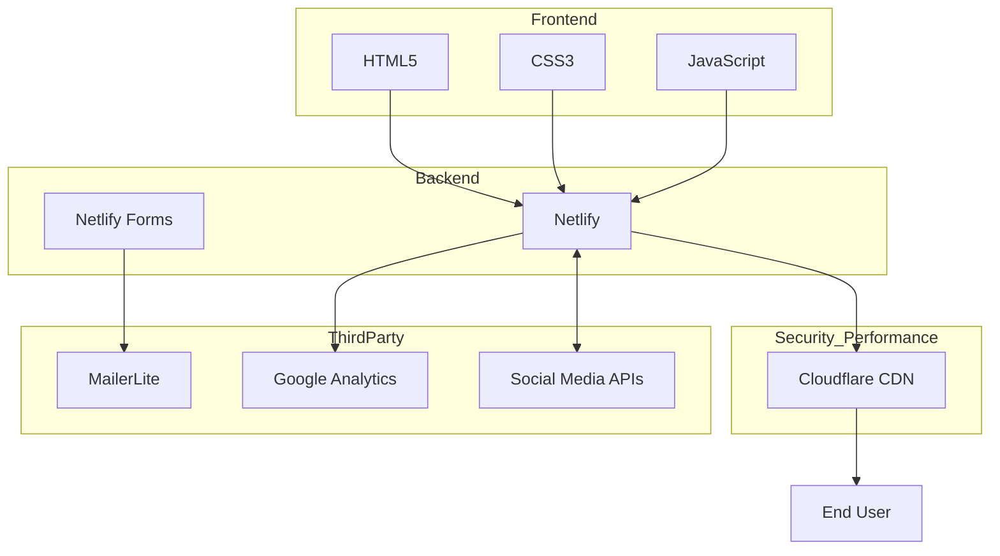

# Technical Architecture

The Welldonewood website uses a modern web stack with a focus on performance and maintainability.



## Technology Stack

- **Frontend**: HTML5, CSS3 (with modern features like Flexbox and Grid), JavaScript (ES6+)
- **Hosting & Deployment**: Netlify with continuous deployment from GitHub
- **Security & Performance**: Cloudflare CDN and security services
- **Forms Processing**: Netlify Forms
- **Email Marketing**: MailerLite via API integration
- **Analytics**: Google Analytics
- **Social Media**: Integration with major social platforms

## Frontend Components

The frontend is built with a focus on simplicity and maintainability:

- **HTML**: Semantic HTML5 markup for better accessibility and SEO
- **CSS**: Custom CSS with variables for consistent theming (no frameworks)
- **JavaScript**: Vanilla JavaScript for interactivity and form validation

## Backend Services

The site leverages a combination of Netlify and Cloudflare:

- **Netlify Hosting**: Fast, global CDN with automatic builds from GitHub
- **Netlify Forms**: Built-in form handling without server-side code
- **Netlify Functions** (planned): Serverless functions for API integrations
- **Netlify CMS**: Visual content editor for non-technical updates
- **Cloudflare**: CDN, DDoS protection, and additional security layers

## Cloudflare Integration

Cloudflare provides multiple benefits for the website:

- **CDN Services**: Global content delivery network for faster page loads
- **DDoS Protection**: Mitigation against distributed denial-of-service attacks
- **Web Application Firewall**: Protection against common web vulnerabilities
- **SSL/TLS Encryption**: Secure HTTPS connections with optimized handshakes
- **Caching**: Intelligent content caching to reduce origin server load
- **DNS Management**: Fast and secure DNS resolution

## Directory Structure

```
welldonewood-site/
├── index.html           # Main homepage
├── css/
│   ├── main.css         # Main stylesheet
│   └── responsive.css   # Responsive design rules
├── js/
│   ├── main.js          # Main JavaScript file
│   └── forms.js         # Form handling
├── images/
│   ├── products/        # Product images
│   └── layout/          # Layout and UI images
├── netlify.toml         # Netlify configuration
└── docs/                # Documentation
```

## Deployment Architecture


## Google Services Integration

The website integrates with Google services through the Gmail account (stan@welldonewood.com):

- **Google Search Console**: For indexing, search performance, and site health monitoring
- **Google Analytics**: For visitor tracking and behavior analysis
- **Google Business Profile**: For local search optimization and customer engagement

## Performance Optimization

The site implements several performance optimizations:

- **Cloudflare Optimization**:
  - Brotli compression
  - Minification of HTML, CSS, and JavaScript
  - Browser cache optimization
  - HTTP/2 and HTTP/3 support

- **Image Optimization**:
  - WebP format with JPEG fallbacks
  - Responsive images
  - Lazy loading for below-fold images
  - Content-aware compression

- **Code Optimization**:
  - CSS minification
  - Critical CSS inlining
  - Efficient cache policies
  - Minimal JavaScript dependencies 