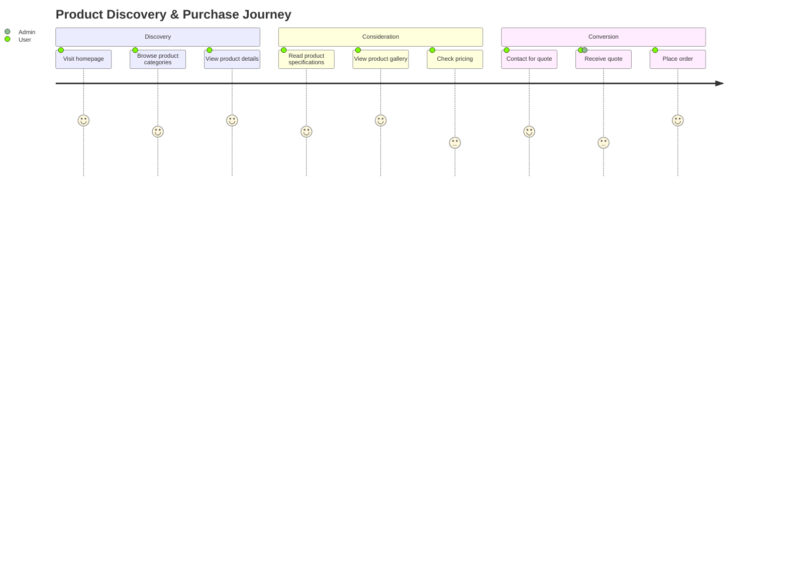
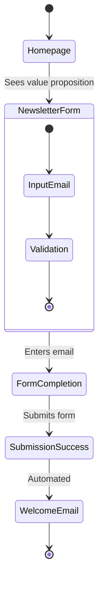
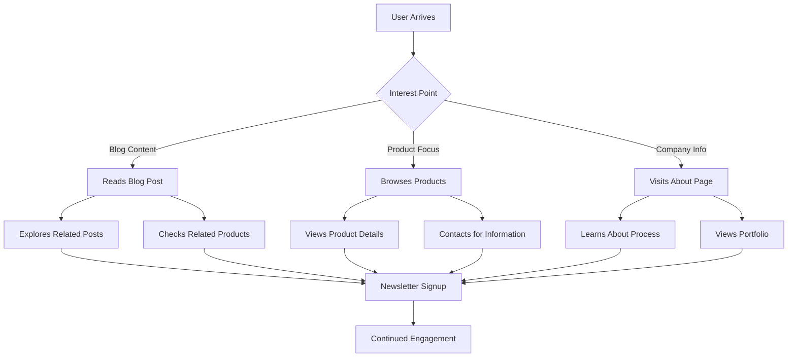
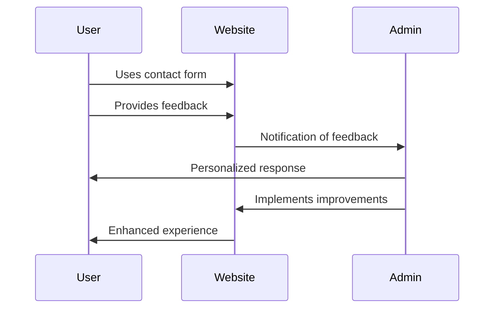

# User Journeys

This document outlines the primary user journeys on the Welldonewood website.

## Product Discovery Journey

### Key Touchpoints

The product discovery journey includes several key touchpoints:

1. **Entry Points**:
   - Direct URL
   - Search engine results
   - Social media links

2. **Navigation Paths**:
   - Homepage featured products → Product detail
   - Products page → Category → Product detail
   - Blog post → Related product

3. **Conversion Points**:
   - Contact form submissions
   - Quote requests
   - Direct orders

## Newsletter Subscription Journey

### Journey Optimization

The newsletter subscription process has been optimized for conversion with:

- Minimal required fields (just email)
- Clear value proposition
- Prominent placement on homepage
- Mobile-friendly design
- Immediate confirmation

## Content Engagement Journey

## User Feedback Flow

### Feedback Integration

User feedback is integrated into the development process through:

1. Collection via contact forms
2. Regular review of submissions
3. Prioritization of improvements
4. Implementation in development cycles
5. Follow-up with users who provided feedback 